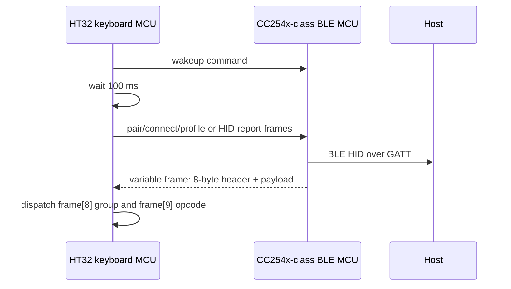

# Anne Pro 2 BLE 固件与键盘侧 UART 协议

本文记录对官方 Anne Pro 2 C18 固件和 QMK AnnePro2 驱动的静态分析结果，用于清洁室（clean-room）实现 BLE 模块。结论分为三类：**已确认（固件）**、**已确认（QMK）**、**推断**。未标为已确认的字段不能作为互操作性保证。

> 本文不复制官方固件代码，也不建议把官方 BLE 映像或 TI BLE 协议栈反编译结果直接并入新的实现。

QMK 键盘侧可靠性补丁、验证边界与上游 PR 模板见 [BLE 可靠性修复说明](ble-reliability-pr.md)。

## 固件样本与映像布局

| 映像 | 路径 | 大小 | SHA-256 | 静态结论 |
| --- | --- | ---: | --- | --- |
| 键盘主控 | [`key-c18-2.36.3.bin`](../../assets/ap2_fw/key-c18-2.36.3.bin) | 46,779 B (`0xb6bb`) | `b9bfa750e8c7ccdbed0c1f6de8aeb4eb1d569dc5cc075afdb2a93fe5e20730de` | 裸 Cortex-M0 映像；初始 SP `0x20001db0`，复位向量 `0x0000f479`。 |
| BLE 旧版 | [`ble-c18-1.00.bin`](../../assets/ap2_fw/ble-c18-1.00.bin) | 155,648 B (`0x26000`) | `48389584acaecc90b7ae012760dc6048ee9eb72b254c4619461d2eaf672ea123` | 8051 系列原始 flash 映像，尾部以 `0xff` 填充。 |
| BLE alpha | [`ble-c18-2.00-alpha.bin`](../../assets/ap2_fw/ble-c18-2.00-alpha.bin) | 155,648 B (`0x26000`) | `d7547d8cfd7b05685539b6d6eef2d2a0ae88d8fba9a775b740766e32b9f86ba6` | 同为 8051 系列原始 flash 映像，尾部以 `0xff` 填充。 |

### BLE SoC

**已确认（固件）**：alpha 映像从 `0x0000` 起以 8051 `LJMP` 向量表开始，复位跳转目标为 `0x2529`；代码中还可见跳转至 `0x3ad2`、`0x3f25` 等中断入口。alpha 映像在 `0x1b219` 写入 SFR `0x86`，在 `0x1f84` 写入 SFR `0xc1`。

**已确认（芯片文档）**：TI CC254x 的 UART0 寄存器图中 `U0CSR=0x86`、`U0DBUF=0xc1`；CC2541 是带两个 UART 的 8051 BLE SoC，提供 128/256 KB flash。见 [CC2541 产品页](https://www.ti.com/product/CC2541)、[CC2541 datasheet](https://www.ti.com/lit/ds/symlink/cc2541.pdf) 与 [CC253x/CC254x 用户指南](https://www.ti.com/lit/ug/swru191f/swru191f.pdf)。

**结论（推断，置信度高）**：BLE 板使用 CC254x 兼容 SoC，且很可能是 CC2541F256 一类器件。由于 CC2540/CC2541 等器件具有相近的 8051 与寄存器特征，尚不能仅凭映像确定精确型号；实现和量产前应读取 PCB 丝印或调试接口芯片 ID。

两个 BLE 映像只有约 28,377/155,648 字节（18.2%）在同一偏移相同，说明两次构建发生了大量重排或重链接；不能把原始二进制 diff 直接解释为功能变更。可见字符串包括 `AnnePro2 P1` 至 `P4`、`HID Keyboard`、`Hardware Revision`、`Software Revision`、`Manufacturer Name` 等，强烈指示四个 profile 与标准 HID/DIS GATT 服务。alpha 映像中没有字符串 `AP2`；设备列表出现旧名称仍可能来自 host 缓存，不能反推当前广播包。

### BLE 镜像的 UART 与 framing 实现

alpha 镜像是 IAR banked 8051 布局，线性文件偏移不等于 CPU 逻辑地址；自动
xref 未重映射 bank 时不可信。以下结论来自指令和寄存器的直接检查：

- 物理偏移 `0x1f84` 写 `U0DBUF (SFR 0xc1)`；
- TX 环形队列位于 XDATA `0x096d..0x09ec`，read/write index 分别为
  `0x09ed` / `0x09ee`，容量 128 字节；
- 物理偏移约 `0x1b209` 初始化 UART0/DMA RX；
- 物理偏移 `0x1d065` 的构造器写 `0x7b`、`0x10`、routing/type 字段、
  清零 length/status，并在 header byte 7 写 `0x7d`；
- `0x1d0f0` 在 byte 8/9 追加 group/opcode，从 byte 10 复制参数，并增加
  byte 4 的 payload 长度；
- `0x1d141` / `0x1d14d` 一带检查和解析同一 framing。

因此 `byte 4` 是单字节 payload 长度、总帧长是 `8 + byte[4]`，已经不是单纯
根据 QMK 模板的推断。byte 5 仍为 0；尚未发现它在现有固件中扩展长度。

## 键盘主控与 BLE 模块的物理链路

**已确认（QMK）**：C18 主控使用 UART 与 BLE 模块连接：

| 方向 | 主控引脚 | 宏名 |
| --- | --- | --- |
| 键盘主控 TX → BLE RX | PA4 | `LINE_BT_UART_TX` |
| BLE TX → 键盘主控 RX | PA5 | `LINE_BT_UART_RX` |

串口速率为 **115200 bit/s**。QMK 启动时初始化串口，发送 wakeup 命令，等待 100 ms 后清空接收缓冲区。协议由主控 UART 直接控制 BLE 行为，不是标准 HCI 传输。



源码依据：[引脚定义](../../modules/qmk_firmware/keyboards/annepro2/c18/config.h)、[初始化与接收](../../modules/qmk_firmware/keyboards/annepro2/annepro2.c)、[BLE 发送路径](../../modules/qmk_firmware/keyboards/annepro2/annepro2_ble.c)。

## 官方键盘主控的 BLE UART 接收路径

键盘主控映像按 `0x4000` 为 image base 反汇编。关键调用链如下：

```text
USART1 IRQ vector +0xa0 -> 0xec83
0xec82: read USART1 (0x40040000) -> RAM RX buffer 0x20001384
0xec82 -> 0x58a4: consume one UART byte
0x58b2: completed frame dispatch
         compare frame[8] with 13-entry group callback table
```

启动时恢复出的 group callback 表为：

| group | handler | group | handler |
| ---: | ---: | ---: | ---: |
| `0x01` | `0x5d89` | `0x20` | `0x6411` |
| `0x02` | `0x6257` | `0x30` | `0x6035` |
| `0x03` | `0x631f` | `0x40` | `0x6359` |
| `0x10` | `0x5b57` | `0x50` | `0x5acd` |
| `0x12` | `0x62fd` | `0x80` | `0x67e3` |

`0x11`、`0x21`、`0x60` 的 handler 为空。group `0x20` 再按 `frame[9]`
跳转；opcode `0x07` 进入 `0x6612`，opcode `0x0c` 的 `0x66d6` 分支用
`(12, 0, 0)` 调用 `0x7eac`。

进一步沿调用链检查纠正了先前的“内部队列”解释：`0x7eac` 调用 `0x85c0`
构造协议 header，调用 `0x8606` 追加 group `0x20`、opcode `0x0c` 和两个
零字节，再经 `0xacac` 进入协议发送路径。完整输出为：

```text
7b 12 43 00 04 00 00 7d 20 0c 00 00
```

这证明输入 `20/0c` 是 BLE 模块主动发起、官方键盘主控必须回复的握手请求，
而不是 connect 命令的同步返回值。旧 QMK 只把所有 11-byte RX 覆盖到
`ble_capslock`，没有发出这条回复。

`0x6612` 分支同样不是 disconnect handler。它读取 `20/07` 的单字节 value，
保留该值，把 routing 字段反转为 `0x43` 并发送：

```text
7b 12 43 00 03 00 00 7d 20 07 VV
```

因此 `20/07` 是 BLE 发起、主控必须原值回复的状态同步请求。固件静态分析尚未
确定 `VV` 的业务名称，但已足以实现兼容响应；它本身不改变 QMK host route。

对 `0x7eac` 的全映像 callsite 检查还发现两处主动发送 opcode `0x0b`：
`0xa42c` 发送 `(0x0b, value, 1)`，`0xa444` 发送
`(0x0b, value, 0)`。它们是键盘主控主动状态通知，不是当前已确认的 BLE→主控
断开 counterpart。这个负面结果不能排除 BLE 通过其他 group/opcode 报告
断链，但足以说明不能凭空定义一个 disconnect frame。

## 主控 → BLE：帧格式

除 bootloader 命令外，QMK 构造的命令都以如下 10 字节头开始：

```text
7b 12 53 00 LL 00 FF 7d GG OO [payload...]
```

- `LL`：**已确认（BLE 固件）**为从 byte 8 开始的 payload 长度；总帧长为
  `8 + LL`。键盘报告的 `LL=0x0a` 等于 `GG+OO` 两字节加 8-byte boot
  keyboard report；consumer 的 `0x06` 同理。byte 5 在已知路径中保持 0。
- `FF`：在 wakeup 为 `0x01`，普通命令为 `0x00`；语义未知。
- `0x7d`：所有已知模板固定出现；语义未知，不能当作校验和或转义字节处理。
- `GG` / `OO`：**推断**为命令组和操作码。下表的分组名称仅为实现时的便捷命名。

### 已知命令

表中每个字节均为 QMK 实际发送模板。`S` 是 slot，取 `0..3`。

| 用途 | 帧（十六进制） | 证据与说明 |
| --- | --- | --- |
| 唤醒 BLE | `7b 12 53 00 03 00 01 7d 02 01 02` | 系统组（推断）`0x02/0x01`，值 `0x02`。 |
| 请求 BLE IAP/bootloader | `7b 10 51 10 03 00 00 7d 02 01 01` | 特殊前缀/版本字段；不要与普通帧合并解释。尚未在实机捕获验证。 |
| 广播/选择 slot | `7b 12 53 00 03 00 00 7d 40 01 S` | profile/pairing 组 `0x40/0x01`；AP2D KEY 3.08 `0x7DF4` 也只编码一个 slot 字节。 |
| 连接 slot | `7b 12 53 00 03 00 00 7d 40 04 S` | profile/pairing 组 `0x40/0x04`；AP2D KEY 3.08 `0x7DF4` 也只编码一个 slot 字节。 |
| 删除配对 | `7b 12 53 00 02 00 00 7d 40 05` | `0x40/0x05`，无额外 payload。 |
| 键盘 HID 报告 | `00 7b 12 53 00 0a 00 00 7d 10 04 R0..R7` | 先送一个额外 `00`，再送 `0x10/0x04` 和 8-byte boot keyboard report。 |
| Consumer 报告 | `00 7b 12 53 00 06 00 00 7d 10 08 C0 00 00 00` | 先送一个额外 `00`，再送 `0x10/0x08` 和 4-byte payload。 |

### Slot 命令的特殊尾字节

**已确认（QMK 历史）**：QMK 的多配对修复将 broadcast/connect 模板改为 10 字节头，并在 slot 后显式再发送 `0x00`。因此即使 `LL=0x03` 看起来只覆盖组、操作和 slot，实际线上帧仍必须含该尾字节。它是兼容性必需字节，语义未确认，不能假定为 checksum。

历史依据：QMK commit [`37c271460a`](https://github.com/qmk/qmk_firmware/commit/37c271460a)（“fix bluetooth multi-pairing issue”）。

### Consumer 位掩码

QMK 的 4-byte consumer payload 只使用 `C0`，其余三字节始终为 0：

| 功能 | `C0` |
| --- | ---: |
| 静音 | `0x01` |
| 音量增加 | `0x02` |
| 音量降低 | `0x04` |
| 播放/暂停 | `0x08` |
| 下一曲 | `0x10` |
| 上一曲 | `0x20` |

鼠标报告在现有 QMK BLE host driver 中为空实现。选择 “USB” 主机模式时，QMK 只在本地切换 host driver，没有发送一个已知的 BLE disconnect UART 命令。

## BLE → 主控：状态回传

### 通用回包格式

官方 BLE 固件的构造器和实机日志共同确认，回包也使用 `8 + LL` framing：

```text
7b 12 35 00 LL 00 00 7d GG OO [payload...]
```

`0x53` 到 `0x35` 符合请求/响应 routing 字段交换，但具体 nibble 语义尚未完全
命名。当前已观察到：

| 帧 | 结论 |
| --- | --- |
| `... 40 01 00` | broadcast 命令 ACK，高置信度 |
| `... 40 04 00` | connect 命令 ACK，高置信度 |
| `7b 12 35 00 03 00 00 7d 20 07 VV` | BLE 发起的状态同步请求；官方主控原值回复 |
| `7b 12 43 00 03 00 00 7d 20 07 VV` | 官方主控对上述状态同步请求的回复 |
| `7b 12 35 00 03 00 00 7d 20 0c 00` | BLE 发起的建链后握手请求；官方主控回复下行帧 |
| `7b 12 43 00 04 00 00 7d 20 0c 00 00` | 官方主控对上述握手的固定回复 |

不同 macOS 新连接样本中，`20/0c` 在 broadcast ACK 后约 3 秒到 5.2 秒出现，
其中一次连续出现两次。它与连接/HID 配置完成强相关。由于旧 QMK 没有实现
官方回复，两次出现更可能是 BLE 侧重试；这是基于汇编和时序的推断，需继续
验证回复后的重复规律。
目前将它命名为 `HID handshake request`，不声称已经定位到 BLE 固件内的精确
GAP callback。

一次 USB console 重新连接附近捕获到的 `... 20 07 00` 与上述静态路径一致。
QMK 现在会回复 `... 20 07 00`，但不会把它当作 radio disconnect 或连接成功。

冷启动实测进一步证明 `40/04` ACK 不能作为连接依据：第一版自动重连在约
600 ms 依次得到 `40/01 00` 和 `40/04 00`，但 macOS 未连接且 BLE 没有发送
`20/0c`。修正版保持会话内 `last_slot=-1`，500 ms 后只发送 `40/01`；
BLE 在约 532 ms 发出 `20/0c`，QMK 于约 536 ms 切换 route，macOS 同时显示
AnnePro2 已连接。因此对这个冷启动路径，额外 `40/04` 不但不能证明成功，
还会破坏原本有效的 advertising/host reconnect 流程。

### Caps Lock 兼容 ABI

**已确认（旧 QMK 行为）**：原移植把任意 RX 数据按固定大小读入
`ble_capslock_t`：

```c
struct __attribute__((packed)) {
    uint8_t opaque[10];
    bool caps_lock;  // byte 10
};
```

这并不能证明“协议固定为 11 字节”；它只是一个碰巧覆盖 `LL=3` 回包的旧 ABI。
新 parser 应先按 `8 + LL` 分帧，再为已确认的 Caps Lock group/opcode 更新状态。
由于 Caps Lock 的精确 opcode 尚未静态还原，当前 QMK 仍对 11-byte 完整帧保留
旧的最后一字节兼容行为，并通过 debug log 收集真实帧供后续收紧。

## 清洁室 BLE 实现契约

一个兼容替代实现的最小边界如下：

1. 先确认实际 BLE SoC 型号、供电、复位、SWD/debug 与 UART0 引脚；不得仅因本分析而直接刷写 CC2541 目标。
2. UART0 以 115200 8N1 工作，采用可恢复的环形缓冲/parser；按
   `8 + byte[4]` 分帧，完整匹配上表的字节序列，尤其是 slot 命令和 HID
   命令前的额外 `0x00`。
3. 维护四个持久化 bond/profile slot，对应设备名中的 `P1..P4`；slot 行为应通过实机抓包定义（广播、连接、覆盖、删除）。
4. 提供 BLE HID keyboard 和 consumer-control 报告路径；至少覆盖表中的 boot keyboard 8-byte 和 consumer `C0` 位掩码。
5. 建链/HID 配置到达相应阶段后向主控发送 11-byte `20/0c` handshake
   request，并等待 12-byte `20/0c 00 00` response；超时和重试参数仍需实机
   测定。保持 Caps Lock 回包兼容，直到其 group/opcode 被抓包确认。
6. IAP/bootloader 命令在完成抓包、失败恢复与映像格式确认前不实现或默认拒绝，避免把未验证的 `0x7b 10 51 10...` 帧暴露为刷写入口。
7. 只使用有授权的 8051/BLE SDK、协议栈和自行编写的代码；官方二进制只作行为和接口参考。

## 建议的实机验证顺序

用逻辑分析仪同时抓 PA4/PA5（115200、8N1），并保存原始样本与解码 CSV：

1. 上电、QMK wakeup、USB/BLE 模式切换。
2. 首次按各 slot、重复按当前 slot、已配对连接、未配对广播。
3. 键盘、NKRO（如启用）、consumer、Caps Lock LED 同步。
4. 删除配对与重新绑定四个 slot。
5. 官方 BLE 更新/IAP 的完整会话；仅在有可恢复刷写流程后测试。

将每一类样本做成可回放测试：输入 UART 字节流，断言 BLE 状态机、GATT
通知、变长 framing、握手请求/回复和 Caps Lock 回传。特别收集 host 主动断开、
超时断开和关闭蓝牙三种 PA5 流量；当前固件静态分析尚未给出断链 counterpart。
已有的主控侧 framing 与 `20/07`、`20/0c` 回复可用
[`replay_uart.py`](../../tools/reverse/annepro2/replay_uart.py) 重放；它不模拟
CC254x radio/GATT 状态。

## 证据索引

- [`annepro2_ble.c`](../../modules/qmk_firmware/keyboards/annepro2/annepro2_ble.c)：所有主控→BLE 命令模板与 HID 映射。
- [`annepro2.c`](../../modules/qmk_firmware/keyboards/annepro2/annepro2.c)：115200 UART 初始化、wakeup 时序、RX 读取。
- [`annepro2.h`](../../modules/qmk_firmware/keyboards/annepro2/annepro2.h)：11-byte Caps Lock 记录定义。
- [`c18/config.h`](../../modules/qmk_firmware/keyboards/annepro2/c18/config.h)：C18 UART 引脚。
- [`key-c18-2.36.3.bin`](../../assets/ap2_fw/key-c18-2.36.3.bin)：主控 USART1
  parser、group callback 表与 `20/0c` 握手回复构造路径。
- [`ble-c18-2.00-alpha.bin`](../../assets/ap2_fw/ble-c18-2.00-alpha.bin)：CC254x
  UART0 DMA、128-byte TX ring 与 `8 + length` framing 构造器。
- [`DecompileAt.java`](../../tools/reverse/annepro2/DecompileAt.java)：复现主控关键
  地址反汇编/反编译输出的 Ghidra headless helper。
- [`replay_uart.py`](../../tools/reverse/annepro2/replay_uart.py)：逐字节重放 UART
  输入，验证 framing 重同步和已确认的主控回复。
- [TI CC2541 product page](https://www.ti.com/product/CC2541)、[datasheet](https://www.ti.com/lit/ds/symlink/cc2541.pdf)、[CC253x/CC254x user guide](https://www.ti.com/lit/ug/swru191f/swru191f.pdf)：8051/UART/flash 寄存器与器件能力交叉验证。
