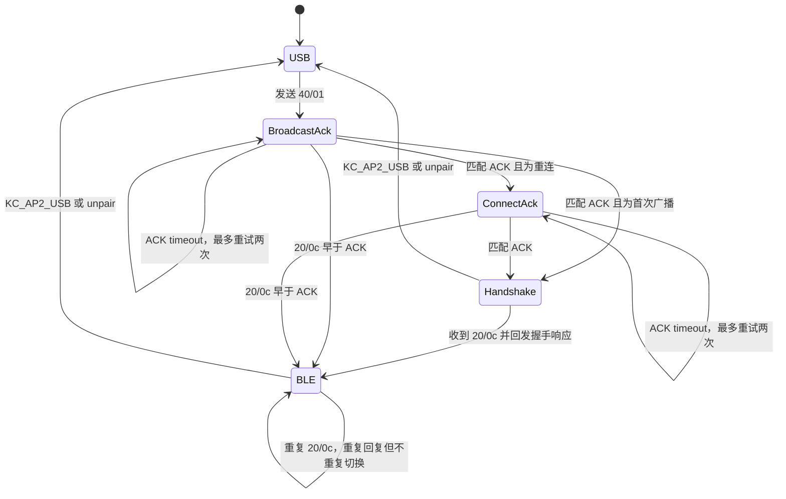

# Anne Pro 2 BLE 可靠性修复：QMK 上游 PR 说明

本文记录 `keyboards/annepro2` 的 BLE UART bugfix、逆向依据和未来上游 PR
边界。当前实现位于本仓库固定的 QMK fork 分支，不是 userspace 补丁。

相关固件证据见 [BLE 固件与 UART 协议分析](ble-firmware-and-uart-protocol.md)，
实机日志步骤见 [BLE USB Console 验证](ble-usb-console-validation.md)。

## 结论

旧实验补丁应撤回，不能作为上游修复：它在发送 `0x40/0x04` connect 命令
200 ms 后无条件切换 QMK host driver。这个延时既不是 BLE radio 建链确认，也
不是 HID 已可发送的确认；命令 ACK 同样只能证明 BLE MCU 收到了命令。

重做后的修复保留以下有协议依据的改动：

1. 将 BLE RX 从固定 11-byte、最长阻塞 10 ms 的读取改成非阻塞变长帧解析；
2. 收到 BLE 主动发起的 `0x20/0x0c` 握手请求时，按官方主控行为回发
   `0x20/0x0c` 响应；只有存在待完成的 BLE route request 时才切换 host
   driver；
3. 用显式状态机关联 `0x40/0x01`、`0x40/0x04` ACK，重连时等待 broadcast
   ACK 后再发送 connect，避免两个命令背靠背进入 BLE MCU；
4. 命令 ACK 500 ms 未到时最多重发两次。该 timer 只恢复丢失的命令/ACK，
   永远不用于推断 radio 或 HID 已就绪。

## 原代码的确定问题

| 项目 | 原代码行为 | 影响 | 新行为 |
| --- | --- | --- | --- |
| host driver 时机 | 写完 connect 命令立即切至 BLE | 在 radio/HID 尚未就绪时开始丢送报告 | 等待 BLE 的异步 `0x20/0x0c` |
| BLE 建链握手 | 忽略所有 RX，除碰巧覆盖 Caps Lock 结构 | 官方主控要求的 `20/0c` 响应缺失；BLE 可能重试或不进入可收报告状态 | 回发官方主控使用的 12-byte 响应，再完成 route |
| BLE RX framing | RX 非空后用 `sdReadTimeout(..., 11, 10)` | 变长帧会错位，矩阵扫描还可能阻塞 10 ms | 按长度字段逐字节非阻塞解析并重同步 |
| 启动 RX | wakeup 后直接丢弃整个 RX 缓冲 | 可能丢失 ACK 或异步状态 | 将缓冲内容交给同一 parser |
| unpair 本地状态 | 发命令但不恢复 USB，也保留旧 slot | 断链后仍把按键送向 BLE；再次按 slot 可能误发 connect | 清除 slot/请求状态并恢复原 host driver |
| BLE 中切换 slot | 旧 BLE driver 继续接收按键 | 等待新 slot 时报告可能仍投向旧链路 | 进入 pending 前恢复原 host driver |
| 重连命令顺序 | broadcast 后立即发送 connect | BLE MCU 尚在切换 advertising/profile 时可能忽略 connect | 收到匹配的 `40/01` ACK 后才发送 `40/04` |
| 命令丢失 | 没有 ACK 关联、重试或状态日志 | 状态可能永久卡住且无法诊断 | 500 ms ACK timeout、最多两次重试；记录 ACK value |

以下旧实验改动不保留：

- 200 ms connect guard；
- 将 slot 选择值当作连接状态；
- 没有协议依据的“断开完成”状态或 watchdog；
- 仅为“原子性”而合并所有 UART 写调用。现有发送者是否会交错没有证据，
  不应把这一点包装成已确认的可靠性修复。

## 固件逆向依据

官方主控固件 `key-c18-2.36.3.bin` 的 USART1 IRQ 为 `0xec82`。它把收到的
字节送入 `0x58a4` parser；完整帧由 `0x58b2` 按 `frame[8]` 查询 13 项 group
callback 表。恢复出的关键表项为：

```text
group 0x10 -> 0x5b57
group 0x12 -> 0x62fd
group 0x20 -> 0x6411
group 0x40 -> 0x6359
group 0x50 -> 0x5acd
```

group `0x20` handler 的 opcode `0x0c` 分支位于 `0x66d6`：

```text
66d6: movs r2, #0
66d8: mov  r1, r2
66da: movs r0, #12
66dc: bl   0x7eac
```

这里必须区分 RX dispatch 和 TX：`0x7eac` 先调用 `0x85c0` 构造 header，
再调用 `0x8606` 追加 group/opcode/payload，最后经 `0xacac` 发送。输入参数
`(12, 0, 0)` 生成的完整回复是：

```text
7B 12 43 00 04 00 00 7D 20 0C 00 00
```

因此 `20/0c` 是 BLE 主动发起、要求键盘主控回复的握手，而不是 `40/04`
命令 ACK。旧 QMK 读取它却不回复，与官方主控行为不一致。

实机 USB log 又提供了时序交叉验证：

```text
7B 12 35 00 03 00 00 7D 40 01 00   # broadcast ACK
7B 12 35 00 03 00 00 7D 40 04 00   # connect ACK
7B 12 35 00 03 00 00 7D 20 0C 00   # 建链后 BLE 发起的握手请求
```

`20/0c` 在 macOS 完成连接流程后出现过两次。结合官方主控会立即回复而旧
QMK 不回复，重复帧很可能是 BLE 侧握手重试；仍需实机验证回复后是否只出现
一次。它与建链/HID 配置完成强相关，但还不足以把它过度命名为纯 radio
`connected`。

## 新状态转换



状态编号依次为 `USB=0`、`WAIT_BROADCAST_ACK=1`、`WAIT_CONNECT_ACK=2`、
`WAIT_HANDSHAKE=3`、`ACTIVE=4`。等待期间按键仍走原 host driver；如果用户
选择 USB 或 unpair，后到的 `20/0c` 仍会获得协议回复，但不会切换 host
driver。重复握手在 route 层是幂等的，不会反复 `clear_keyboard()`。从一个
BLE slot 切换到另一个 slot 时，旧 BLE route 会先撤销，避免 pending 期间
继续向旧链接送键。

ACK 重试耗尽后进入 `WAIT_HANDSHAKE`，而不是伪造失败或连接成功：UART ACK
可能丢失，但 BLE MCU 仍可能已经执行命令并在稍后发出有效握手。首次配对等待
用户在 macOS 操作的时间不设上限。重连 broadcast 的迟到 ACK 仍可继续触发
connect；如果握手先到，则直接完成 route 并取消剩余命令状态。

样本 ACK 的 value 都是 `00`，但目前没有静态证据证明非零值的错误语义。
实现只记录该字段，不据此取消或完成连接。

尚未从 BLE 固件静态确认断链对应 UART 帧。因此当前实现不会根据猜测的 opcode
自动切回 USB；USB 键和 unpair 是已知的本地恢复路径。debug 构建会打印每个
完整 RX 帧，后续可用断链实测补齐协议。

## 上游改动范围

- `annepro2.c`：启动和扫描时非阻塞排空 BLE UART，并运行状态机 task；
- `annepro2_ble.c`：变长 parser、`20/0c` 握手回复、event gate、本地 route
  状态、ACK 顺序/重试和可选日志；
- `annepro2_ble.h`：公开逐字节 RX 入口和非阻塞 task。

不改 QMK core、ChibiOS serial driver、引脚、115200 baud 或现有 TX 字节序列；
不包含官方固件、反编译代码或专有 BLE stack 内容。

## 验证矩阵

| 场景 | 预期 |
| --- | --- |
| 首次选择 slot | `40/01` ACK 不切 driver；收到 `20/0c`，回发响应后才切 BLE |
| 已配对 slot 重连 | `40/04` ACK 不切 driver；握手之后开始发送 HID |
| 重连命令顺序 | 必须先收到匹配的 `40/01` ACK，然后才打印/发送 `40/04` |
| ACK 丢失 | 每 500 ms 重发，初次发送加两次重试；不会据此切 BLE driver |
| ACK value | 日志保留原始值；在语义逆向完成前不把非零值解释为错误 |
| ready 前按键 | 仍由原 USB driver 处理，不送入未就绪 BLE 链路 |
| USB 键后收到延迟握手 | 回复 `20/0c`，但因 route request 已取消而不切换 |
| 重复握手 | 每次回复；driver 不重复切换，按键状态不被再次清空 |
| BLE 状态下选择另一 slot | 立即退出旧 BLE route，等待新 slot 握手 |
| unpair | 发出原有 `40/05`，清除 slot 并恢复 USB |
| RX 半帧/粘包/垃圾前缀 | 矩阵扫描不阻塞；parser 在 `0x7b` 重同步 |
| Caps Lock | 保持原有 11-byte ABI 行为，并记录实际 opcode 供后续收紧 |

构建通过只证明代码可编译。上游 PR 前还需用 C18 实机完成上述矩阵，并保存
USB console 或 PA4/PA5 115200 8N1 双向抓包。

## PR 描述草案

```markdown
## Summary

Fix Anne Pro 2's keyboard-side BLE UART state handling:

- parse variable-length BLE UART frames without blocking matrix scan;
- preserve wakeup responses instead of flushing the RX queue;
- answer the module's 0x20/0x0c handshake with the same response emitted by
  the official keyboard firmware;
- sequence reconnect commands by waiting for the broadcast acknowledgement
  before sending connect, and retry a command if its acknowledgement is lost;
- switch the QMK host driver only after that handshake, not after a connect
  command or its acknowledgement;
- cancel a pending BLE route on USB selection/unpair.

The official keyboard firmware answers an incoming group 0x20 opcode 0x0c
with `7b 12 43 00 04 00 00 7d 20 0c 00 00`. Captured 0x40/0x01 and
0x40/0x04 frames are command acknowledgements and do not prove that HID
reports can be delivered.

## Testing

- `git diff --check`
- `qmk compile -kb annepro2/c18 -km <keymap>`
- Hardware: `<fill in firmware version, host OS, slot and disconnect results>`

No disconnect notification opcode is assumed by this change.
```
