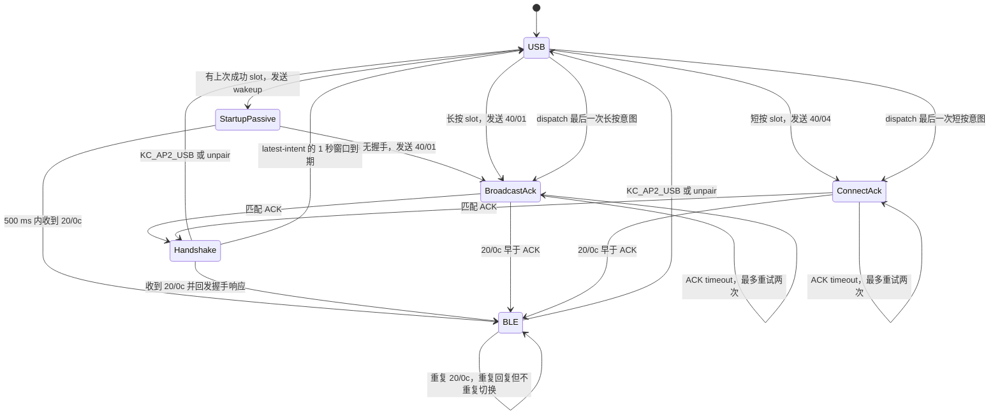

# Anne Pro 2 BLE 可靠性修复：QMK 上游 PR 说明

本文记录 `keyboards/annepro2` 的 BLE UART bugfix、逆向依据和未来上游 PR
边界。当前实现位于本仓库固定的 QMK fork 分支，不是 userspace 补丁。

相关固件证据见 [BLE 固件与 UART 协议分析](ble-firmware-and-uart-protocol.md)，
实机日志步骤见 [BLE USB Console 验证](ble-usb-console-validation.md)。

## 结论

旧实验补丁应撤回，不能作为上游修复：它在发送 `0x40/0x04` connect 命令
200 ms 后无条件切换 QMK host driver。这个延时既不是 BLE radio 建链确认，也
不是 HID 已可发送的确认；命令 ACK 同样只能证明 BLE MCU 收到了命令。

重做后的修复保留以下有协议依据的改动：

1. 将 BLE RX 从固定 11-byte、最长阻塞 10 ms 的读取改成非阻塞变长帧解析；
2. 收到 BLE 主动发起的 `0x20/0x0c` 握手请求时，按官方主控行为回发
   `0x20/0x0c` 响应；只有存在待完成的 BLE route request 时才切换 host
   driver；
3. 按原厂按键语义区分 slot 操作：短按发送一次 `0x40/0x04 connect`，长按
   500 ms 发送一次 `0x40/0x01 broadcast`；每次动作只发送一个
   `0x20/0x0b` 状态通知，不随主命令重试重复；
4. 命令 ACK 500 ms 未到时最多重发两次。该 timer 只恢复丢失的命令/ACK，
   永远不用于推断 radio 或 HID 已就绪；
5. profile 操作采用 single-flight：已有操作 pending 时只记录最后一次 slot
   意图，1 秒有界切换窗口后启动新事务，不进入旧事务的 10 秒握手等待；
6. 按官方主控行为原值回复 BLE 的 `0x20/0x07` 状态同步请求，但不把它猜成
   disconnect 或 connected 事件；
7. 只在 `0x20/0x0c` 握手成功、BLE route 真正启用后，将 slot 写入 QMK
   keyboard EEPROM。下次上电等待 BLE MCU 稳定 500 ms 后，以“本次会话首次
   选择”的语义发送 broadcast；500 ms 内如果 BLE 已自行恢复并发来 handshake，
   则直接完成 route。选择 USB 或 unpair 会清除自动重连。

## 原代码的确定问题

| 项目 | 原代码行为 | 影响 | 新行为 |
| --- | --- | --- | --- |
| host driver 时机 | 写完 connect 命令立即切至 BLE | 在 radio/HID 尚未就绪时开始丢送报告 | 等待 BLE 的异步 `0x20/0x0c` |
| BLE 建链握手 | 忽略所有 RX，除碰巧覆盖 Caps Lock 结构 | 官方主控要求的 `20/0c` 响应缺失；BLE 可能重试或不进入可收报告状态 | 回发官方主控使用的 12-byte 响应，再完成 route |
| BLE RX framing | RX 非空后用 `sdReadTimeout(..., 11, 10)` | 变长帧会错位，矩阵扫描还可能阻塞 10 ms | 按长度字段逐字节非阻塞解析并重同步 |
| 启动 RX | wakeup 后直接丢弃整个 RX 缓冲 | 可能丢失 ACK 或异步状态 | 将缓冲内容交给同一 parser |
| `20/07` 状态同步 | 当作不透明 Caps Lock 结构覆盖 | 官方主控要求的原值响应缺失 | 回发 `20/07 VV`，不据此切 route |
| unpair 本地状态 | 发命令但不恢复 USB，也保留旧 slot | 断链后仍把按键送向 BLE；再次按 slot 可能误发 connect | 清除 slot/请求状态并恢复原 host driver |
| BLE 中切换 slot | 旧 BLE driver 继续接收按键 | 等待新 slot 时报告可能仍投向旧链路 | 进入 pending 前恢复原 host driver |
| 快速切换 slot | 多个操作共享隐式 slot 状态 | 旧 ACK/handshake 可完成错误事务 | single-flight 加 latest-intent；新操作延迟 1 秒有界启动 |
| `20/0b` 状态通知 | 跟随每一次主命令重试 | 把一次按键动作重复报告给 BLE MCU | 每次短按/长按只发送一次 |
| 命令丢失 | 没有 ACK 关联、重试或状态日志 | 状态可能永久卡住且无法诊断 | 500 ms ACK timeout、最多两次重试；记录 ACK value |
| 断电重开 | slot 只保存在 RAM，启动只发送 wakeup | BLE bond 仍在，但 QMK 不请求该 profile，必须手动重新按 slot | 成功握手后持久化 slot；先给 BLE 500 ms 被动恢复窗口，再按需 broadcast |
| 持久化 slot 语义 | `last_slot` 原本只表示本次上电已选择过的 slot | 把 EEPROM 值直接装入它会让冷启动误发 `40/04 connect`，只有 UART ACK、没有 radio link | 单独使用 `startup_slot`；冷启动保持 `last_slot=-1`，复现断电后手动按 slot 的有效路径 |

以下旧实验改动不保留：

- 200 ms connect guard；
- 将 slot 选择值当作连接状态；
- 没有协议依据的“断开完成”状态或 watchdog；
- 仅为“原子性”而合并所有 UART 写调用。现有发送者是否会交错没有证据，
  不应把这一点包装成已确认的可靠性修复。

## 固件逆向依据

官方主控固件 `key-c18-2.36.3.bin` 的 USART1 IRQ 为 `0xec82`。它把收到的
字节送入 `0x58a4` parser；完整帧由 `0x58b2` 按 `frame[8]` 查询 13 项 group
callback 表。恢复出的关键表项为：

```text
group 0x10 -> 0x5b57
group 0x12 -> 0x62fd
group 0x20 -> 0x6411
group 0x40 -> 0x6359
group 0x50 -> 0x5acd
```

group `0x20` handler 的 opcode `0x0c` 分支位于 `0x66d6`：

```text
66d6: movs r2, #0
66d8: mov  r1, r2
66da: movs r0, #12
66dc: bl   0x7eac
```

这里必须区分 RX dispatch 和 TX：`0x7eac` 先调用 `0x85c0` 构造 header，
再调用 `0x8606` 追加 group/opcode/payload，最后经 `0xacac` 发送。输入参数
`(12, 0, 0)` 生成的完整回复是：

```text
7B 12 43 00 04 00 00 7D 20 0C 00 00
```

因此 `20/0c` 是 BLE 主动发起、要求键盘主控回复的握手，而不是 `40/04`
命令 ACK。旧 QMK 读取它却不回复，与官方主控行为不一致。

同一 group 的 opcode `0x07` 分支位于 `0x6612`。它保留输入 value 并反转
routing 字段，构造 `7B 12 43 00 03 00 00 7D 20 07 VV`。这确认了回复格式，
但没有确认 `VV` 的业务名称，因此实现只响应、不切换 route。

实机 USB log 又提供了时序交叉验证：

```text
7B 12 35 00 03 00 00 7D 40 01 00   # broadcast ACK
7B 12 35 00 03 00 00 7D 40 04 00   # connect ACK
7B 12 35 00 03 00 00 7D 20 0C 00   # 建链后 BLE 发起的握手请求
```

`20/0c` 在 macOS 完成连接流程后出现过两次。结合官方主控会立即回复而旧
QMK 不回复，重复帧很可能是 BLE 侧握手重试；仍需实机验证回复后是否只出现
一次。它与建链/HID 配置完成强相关，但还不足以把它过度命名为纯 radio
`connected`。

## 新状态转换



状态编号依次为 `USB=0`、`WAIT_BROADCAST_ACK=1`、`WAIT_CONNECT_ACK=2`、
`WAIT_HANDSHAKE=3`、`ACTIVE=4`、`STARTUP_PASSIVE=5`。等待期间按键仍走原
host driver；如果用户
选择 USB 或 unpair，后到的 `20/0c` 仍会获得协议回复，但不会切换 host
driver。重复握手在 route 层是幂等的，不会反复 `clear_keyboard()`。从一个
BLE slot 切换到另一个 slot 时，旧 BLE route 会先撤销，避免 pending 期间
继续向旧链接送键。

ACK 重试耗尽后进入 `WAIT_HANDSHAKE`，而不是伪造失败或连接成功：UART ACK
可能丢失，但 BLE MCU 仍可能已经执行命令并在稍后发出有效握手。首次配对等待
用户在 macOS 操作的时间不设上限；如果握手先到，则直接完成 route 并取消
剩余主命令状态。

样本 ACK 的 value 都是 `00`，但目前没有静态证据证明非零值的错误语义。
实现只记录该字段，不据此取消或完成连接。

EEPROM 中 `0` 表示保持 USB、禁用冷启动自动连接，`1..4` 分别编码 BLE slot
`0..3`。手动选择 slot 只更新 RAM；如果广播、配对或握手失败，不会污染下次
启动的选择。只有收到 `20/0c` 并切入 BLE route 后才写入 EEPROM，而且仅在
值变化时写，避免每次重连产生 flash wear。`KC_AP2_USB` 和 unpair 写回 `0`。

EEPROM 读取值放在独立的 `startup_slot`。500 ms 等待是非阻塞 timer，期间
只接受 BLE 自行恢复后发来的 `20/0c`；没有握手才发送一次 `40/01`。实测
100 ms 的首次命令没有 ACK，而约 600 ms 的重试开始得到 ACK，说明旧的
100 ms wakeup 等待不足以代表 BLE MCU/radio 已稳定。固件只保存最后一个成功
slot，不扫描全部 bond，也不循环尝试多个 host。

`20/0c` 不包含 slot 或 transaction ID，因此切槽后极晚到达的旧握手无法仅靠
UART 字节可靠归属。single-flight 消除了 QMK 主动重叠命令，并用 1 秒窗口吸收
常见迟到事件，但这条协议边界仍需实机抓包验证，不能声称已从格式上彻底消除。

尚未从 BLE 固件静态确认断链对应 UART 帧。因此当前实现不会根据猜测的 opcode
自动切回 USB；USB 键和 unpair 是已知的本地恢复路径。debug 构建会打印每个
完整 RX 帧，后续可用断链实测补齐协议。

## 上游改动范围

- `annepro2.c`：启动和扫描时非阻塞排空 BLE UART，并运行状态机 task；
- `annepro2_ble.c`：变长 parser、`20/07`/`20/0c` 回复、event gate、本地
  route 状态、ACK 重试、single-flight slot 操作、成功 slot 持久化和可选日志；
- `annepro2_ble.h`：公开逐字节 RX 入口和非阻塞 task。

不改 QMK core、ChibiOS serial driver、引脚、115200 baud 或现有 TX 字节序列；
不包含官方固件、反编译代码或专有 BLE stack 内容。

## 验证矩阵

| 场景 | 预期 |
| --- | --- |
| 长按 slot 配对 | 一次 `40/01`；2.05/2.13 都加一次 `20/0b slot,1`；ACK 不切 driver，`20/0c` 后才切 BLE |
| 短按 slot 重连 | 一次 `40/04`；2.05 加 `20/0b slot,0`，2.13 加 `20/24 slot,2`；ACK 不切 driver，握手之后开始发送 HID |
| slot 状态与重试 | 主命令可重发，`20/0b` 或 `20/24` 整个动作只能发送一次 |
| `20/07` | 对任意 value 原值回复，不改变 route |
| 冷启动自动重连 | 先等待 500 ms 被动握手；未发生时只对上次成功 slot 执行 broadcast，不发送 `40/04`/`20/0b` |
| 首次/失败选择 | 未收到 `20/0c`、未切 BLE route 时不覆盖 EEPROM 中的上次成功 slot |
| USB 后冷启动 | `KC_AP2_USB` 清除自动重连；下次启动停留 USB |
| 快速切换 slot | 1 秒窗口内只 dispatch 最后一次意图；不得重叠发送 profile 命令 |
| ACK 丢失 | 每 500 ms 重发，初次发送加两次重试；不会据此切 BLE driver |
| ACK value | 日志保留原始值；在语义逆向完成前不把非零值解释为错误 |
| ready 前按键 | 仍由原 USB driver 处理，不送入未就绪 BLE 链路 |
| USB 键后收到延迟握手 | 回复 `20/0c`，但因 route request 已取消而不切换 |
| 重复握手 | 每次回复；driver 不重复切换，按键状态不被再次清空 |
| BLE 状态下选择另一 slot | 立即退出旧 BLE route，等待新 slot 握手 |
| unpair | 发出原有 `40/05`，清除 slot 并恢复 USB |
| RX 半帧/粘包/垃圾前缀 | 矩阵扫描不阻塞；parser 在 `0x7b` 重同步 |
| Caps Lock | 不再把任意 11-byte 帧末字节当状态；记录实际帧，确认 opcode 后接入严格 1/2-byte decoder |

构建通过只证明代码可编译。上游 PR 前还需用 C18 实机完成上述矩阵，并保存
USB console 或 PA4/PA5 115200 8N1 双向抓包。

## PR 描述草案

```markdown
## Summary

Fix Anne Pro 2's keyboard-side BLE UART state handling:

- parse variable-length BLE UART frames without blocking matrix scan;
- preserve wakeup responses instead of flushing the RX queue;
- answer the module's 0x20/0x07 state-sync request while preserving its value;
- answer the module's 0x20/0x0c handshake with the same response emitted by
  the official keyboard firmware;
- emit the stock slot-key state notification once per tap or hold, independently
  of command retries;
- serialize slot operations and keep only the latest intent while one is
  pending;
- retry a profile command if its acknowledgement is lost;
- switch the QMK host driver only after that handshake, not after a connect
  command or its acknowledgement;
- remember the slot only after a successful handshake and automatically request
  that slot after the next power-on, while allowing the module to restore the
  link during the existing 500 ms wakeup settling period;
- cancel a pending BLE route on USB selection/unpair.

The official keyboard firmware answers an incoming group 0x20 opcode 0x07
with a value-preserving `7b 12 43 00 03 00 00 7d 20 07 VV`, and opcode
0x0c with `7b 12 43 00 04 00 00 7d 20 0c 00 00`. Captured 0x40/0x01
and 0x40/0x04 frames are command acknowledgements and do not prove that HID
reports can be delivered.

## Testing

- `git diff --check`
- `qmk compile -kb annepro2/c18 -km <keymap>`
- Hardware: C18, BLE firmware BLE-1.5.0, macOS; fresh slot 1 pairing reached
  `20/0c`, switched to BLE, and continued typing after USB was unplugged.
- Hardware cold boot: the saved slot was selected automatically at 504 ms,
  emitted `40/01`, reached `20/0c`/BLE route at 536 ms, and macOS reported
  AnnePro2 connected. No `40/04` was emitted. This validates the fallback
  path before the passive-startup state was added.
- Host replay: garbage-prefix resynchronization, variable frame lengths,
  value-preserving `20/07`, and fixed `20/0c` responses pass.
- Pending hardware validation: passive startup handshake, one-shot `20/0b`,
  latest-intent slot switching, explicit USB-preference persistence, and
  failed-slot preservation.

No disconnect notification opcode is assumed by this change.
```
